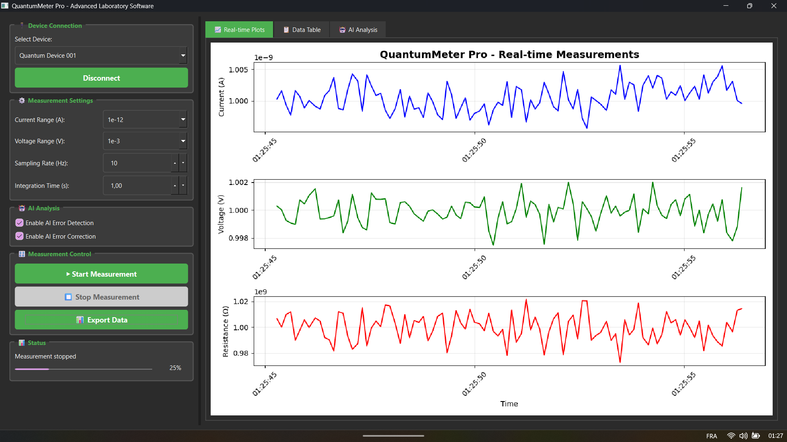

# QuantumMeter Pro - Présentation

<div align="center">
  
  
  ## 🔬 Advanced Laboratory Software for Quantum Measurement Devices
  
  *Revolutionizing Quantum Measurement Technology*
</div>

---

## 🌟 Vue d'ensemble

QuantumMeter Pro est une solution logicielle de laboratoire complète conçue pour interfacer avec et contrôler les appareils de mesure quantique. Ce logiciel permet aux laboratoires nationaux et aux universités de standardiser leurs mesures électriques sans multiplier les appareils.

### 🎯 Objectifs principaux

- **Standardisation** : Harmoniser les mesures quantiques entre laboratoires
- **Précision** : Atteindre une précision de 0.01 ppm
- **Automatisation** : Réduire l'intervention humaine dans les mesures
- **Analyse intelligente** : Détection automatique d'anomalies et correction d'erreurs

## 🔬 Fonctionnalités clés

### 📊 Mesure en temps réel
- **Courant** : Précision nanoampère (1 nA de base)
- **Tension** : Précision microvolt (μV)
- **Résistance** : Calcul automatique en mégohms (MΩ)
- **Température** : Surveillance de l'environnement contrôlé

### 🤖 Module d'analyse IA
- **Analyse statistique** : Moyenne, écart-type, min/max
- **Détection d'anomalies** : Règle des 3-sigma
- **Évaluation de qualité** : Score de qualité global
- **Correction d'erreurs** : Détection automatique des erreurs expérimentales

### 📁 Gestion des données
- **Formats d'export** : CSV, Excel, SQL
- **Capacités d'import** : Chargement de données existantes
- **Données d'exemple** : Ensembles de données de démonstration
- **Rétention des données** : Politiques de stockage configurables

## 🚀 Plateformes supportées

### 🖥️ Application Desktop
- **Interface PyQt6** : Interface graphique native
- **Graphiques Matplotlib** : Visualisation en temps réel
- **Contrôle des appareils** : Connexion/déconnexion locale

### 🌐 Dashboard Web
- **Interface Flask** : Serveur web intégré
- **Graphiques Chart.js** : Visualisation interactive
- **API RESTful** : Intégration avec d'autres systèmes

### ☁️ Version Cloud
- **Streamlit** : Déploiement cloud-ready
- **Compatibilité maximale** : Fonctionne sur tous les navigateurs
- **Accès distant** : Monitoring depuis n'importe où

## 📊 Spécifications techniques

### Précision de mesure
- **Courant** : 1 nA de base avec 0.01% de précision
- **Tension** : 1 V de base avec 1 μV de précision
- **Résistance** : Calculée à partir du rapport V/I
- **Température** : 23°C ± 0.1°C contrôlé

### Appareils supportés
- **Ponts de résistance quantique** : Mesure de résistance haute précision
- **Mètres nanoampère** : Mesure de courant ultra-faible
- **Étalons de tension** : Sources de tension calibrées
- **Contrôleurs de température** : Surveillance environnementale

## 🔧 Configuration

L'application supporte plusieurs appareils de mesure quantique via le fichier `config/devices.yaml` :

```yaml
devices:
  quantum_device_001:
    name: "Primary Quantum Meter"
    type: "quantum_resistance_bridge"
    connection:
      type: "serial"
      port: "COM3"
      baudrate: 115200
    measurement_ranges:
      current: [1e-12, 1e-9, 1e-6, 1e-3]
      voltage: [1e-3, 1e-0, 1e3]
    sampling_rates: [1, 10, 100, 1000]
```

## 🎯 Cas d'usage

### 🏛️ Laboratoires nationaux
- **Étalonnage** : Standardisation des mesures de référence
- **Validation** : Comparaison avec les étalons internationaux
- **Traçabilité** : Documentation complète des mesures

### 🎓 Universités
- **Recherche** : Outils pour la recherche en physique quantique
- **Enseignement** : Démonstration des concepts de mesure
- **Formation** : Apprentissage des techniques de laboratoire

### 🏭 Industrie
- **Contrôle qualité** : Vérification de la précision des appareils
- **R&D** : Développement de nouveaux capteurs
- **Production** : Monitoring en temps réel des processus

## 📞 Support

- **Issues** : [GitHub Issues](https://github.com/michaelgermini/quantum-meter-pro/issues)
- **Documentation** : [Wiki](https://github.com/michaelgermini/quantum-meter-pro/wiki)
- **Email** : michael@germini.info
- **GitHub** : [michaelgermini](https://github.com/michaelgermini)
- **Auteur** : Michael Germini

---

<div align="center">
  **Fait avec ❤️ pour la communauté scientifique**
  
  *QuantumMeter Pro - Faire avancer la technologie de mesure quantique*
</div>
